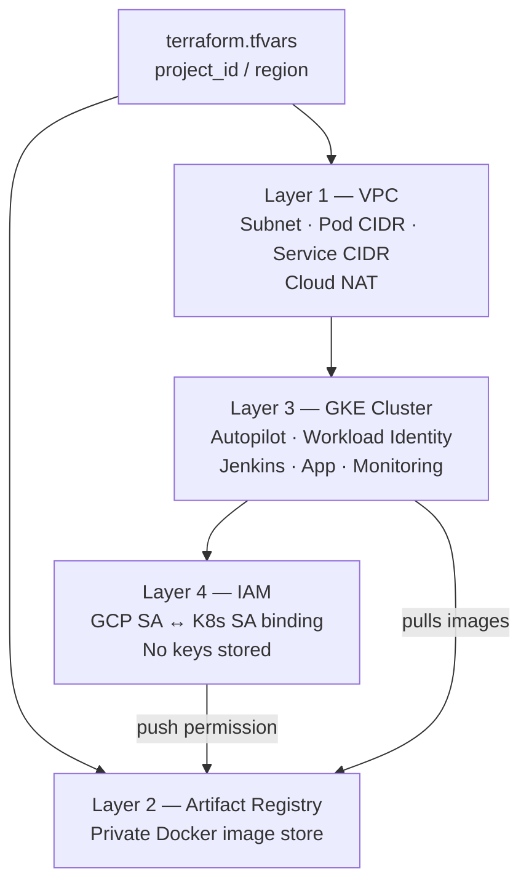
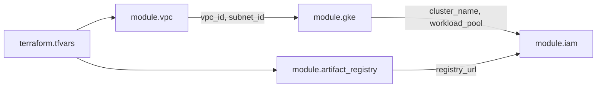

# BarberOps

## Infrastructure Overview

I built this infrastructure in layers, where each layer is a dependency of the next. Nothing is arbitrary — the order matters and the diagrams below reflect that.

---

### Layer 1 — VPC (Networking)

This is the foundation I started with, everything else lives inside it. I created a private network in GCP's London region with three IP ranges: one for the subnet itself, one for Kubernetes pods, and one for Kubernetes services. Nothing can reach anything inside unless I explicitly allow it. I added Cloud NAT so private nodes can pull images from the internet without needing public IP addresses.

---

### Layer 2 — Artifact Registry

I set up a private Docker image store inside the GCP project. Jenkins pushes built images here and GKE pulls from here. Because they live in the same GCP project, no extra authentication is needed between them.

---

### Layer 3 — GKE Cluster

This is the Kubernetes cluster that runs everything, Jenkins, The App, and monitoring. It lives inside the VPC I created in Layer 1, which is why the VPC had to exist first. I used Autopilot mode so Google manages the underlying nodes and I only manage pods. I also enabled Workload Identity here, which is what allows pods to talk to GCP services securely without storing any credentials.

---

### Layer 4 — IAM

I created a GCP service account for Jenkins and granted it permission to push images to Artifact Registry. I then bound that GCP service account to the Kubernetes service account Jenkins runs as inside the cluster. This is Workload Identity in practice — when Jenkins runs a build it automatically has the right permissions, with no keys or passwords stored anywhere. This layer had to come after GKE because the binding references the cluster's workload pool.

---

### How the Root Module Ties It Together

I never run individual modules directly. The root module is the only entry point — it calls each module and wires the output of one into the input of the next.

The dependency chain is intentional: VPC → GKE → IAM. Artifact Registry is independent and provisions in parallel with GKE. The root module handles all of this wiring — no values are passed manually between modules.
