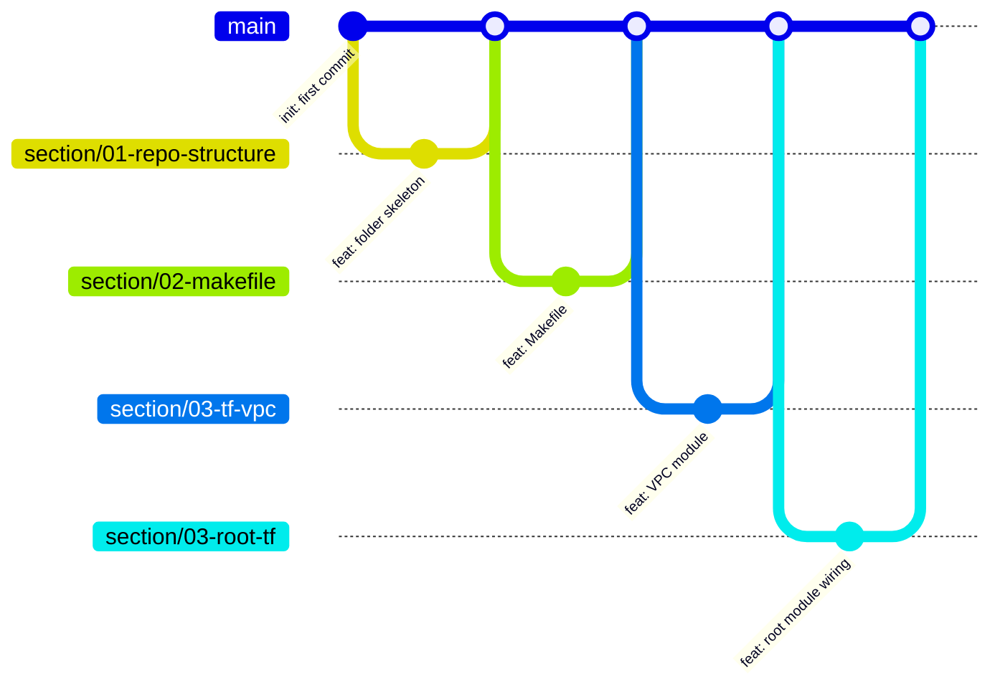
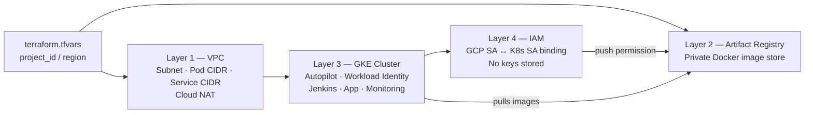
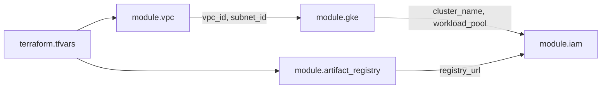
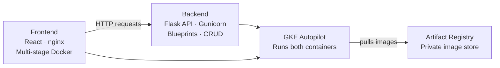

# ✂️ BARBEROPS-X Project

## 💫 About Me:
Self-taught engineer with nearly 10 years of experience working across some of the biggest names in tech: Sky, AWS, and NBCUniversal.<br>Currently building BarberOps-X a 3 tier production-grade application project on GKE Autopilot with modular Terraform, Jenkins CI/CD, ArgoCD GitOps, and Prometheus observability. <br>Every decision documented, every trade-off explained.<br>Focused on platform engineering and building infrastructure the right way!<br>trunk-based Git workflow, infrastructure as code, zero hardcoded credentials, and systems that scale.


## 💻 Tech Stack:
       


## Git Strategy

I use a **trunk-based, section-scoped branching strategy**. Every piece of work lives on its own short-lived branch, gets reviewed as a PR, and merges into `main`. There are no long-lived feature branches — `main` is always the source of truth.

I chose this approach for four reasons:

- `main` is always in a working state
- Every change is traceable — you can see exactly what was added and when just by reading the git graph
- If something breaks, you can pinpoint exactly which branch introduced it
- When Jenkins and ArgoCD are wired in, merging to `main` automatically triggers a build and deploy — so the branching strategy becomes the deployment mechanism

### Branch Naming

Branches follow a `section/<number>-<description>` convention that mirrors the build order of the project:

```
main
├── section/01-repo-structure
├── section/02-makefile
├── section/03-tf-vpc
├── section/03-tf-registry
├── section/03-tf-gke
├── section/03-tf-iam
├── section/03-root-tf
└── section/doc-01
```

The section number groups related work (e.g. all Terraform modules share `03-`) and makes the progression of the project readable in the branch list without needing to open each one.

### Commit Convention

| Prefix | When I use it |
|--------|--------------|
| `feat:` | Writing new modules, app code, manifests |
| `fix:` | Correcting errors in existing files |
| `docs:` | README updates |
| `ci:` | Jenkinsfile changes |
| `chore:` | Updating `.gitignore`, deleting placeholders |

### Flow



Each branch has one clear purpose, one PR, and merges cleanly — keeping `main` always deployable.

---

## Infrastructure Overview

I built this infrastructure in layers, where each layer is a dependency of the next. Nothing is arbitrary — the order matters and the diagrams below reflect that.



---

### Layer 1 — VPC (Networking)

This is the foundation I started with, everything else lives inside it. I created a private network in GCP's London region with three IP ranges: one for the subnet itself, one for Kubernetes pods, and one for Kubernetes services. Nothing can reach anything inside unless I explicitly allow it. I added Cloud NAT so private nodes can pull images from the internet without needing public IP addresses.

---

### Layer 2 — Artifact Registry

I set up a private Docker image store inside the GCP project. Jenkins pushes built images here and GKE pulls from here. Because they live in the same GCP project, no extra authentication is needed between them.

---

### Layer 3 — GKE Cluster

This is the Kubernetes cluster that runs everything, Jenkins, The App, and monitoring. It lives inside the VPC I created in Layer 1, which is why the VPC had to exist first. I used Autopilot mode so Google manages the underlying nodes and I only manage pods. I also enabled Workload Identity here, which is what allows pods to talk to GCP services securely without storing any credentials.

---

### Layer 4 — IAM

I created a GCP service account for Jenkins and granted it permission to push images to Artifact Registry. I then bound that GCP service account to the Kubernetes service account Jenkins runs as inside the cluster. This is Workload Identity in practice — when Jenkins runs a build it automatically has the right permissions, with no keys or passwords stored anywhere. This layer had to come after GKE because the binding references the cluster's workload pool.

---

### How the Root Module Ties It Together

I never run individual modules directly. The root module is the only entry point — it calls each module and wires the output of one into the input of the next.



The dependency chain is intentional: VPC → GKE → IAM. Artifact Registry is independent and provisions in parallel with GKE. The root module handles all of this wiring — no values are passed manually between modules.

---

## Application Overview

With the infrastructure in place, I built the two application tiers — backend and frontend — and containerised each one ready for deployment on GKE.



---

### Application Layer 1 — Backend (Flask API)

This is the brain of the application. I built the API in Flask using a blueprint structure so each concern — health checks and bookings — lives in its own module rather than one flat file. The bookings endpoints cover the full CRUD surface: create, read, update, and delete. I containerised it with Docker, running the app under Gunicorn. One thing I hit early was a permission error — Gunicorn couldn't write its worker files because the app user had no home directory. I fixed that by explicitly setting a home directory for the user in the Dockerfile, which is the kind of thing that only shows up when you actually run the container rather than just build it.

---

### Application Layer 2 — Frontend (React)

This is what a customer would actually see and interact with. I built the UI in React with a booking form and a dark theme. The Dockerfile uses a multi-stage build: the first stage installs dependencies and compiles the static assets in a Node image, and the second stage copies only the built output into a lightweight nginx image. The result is a production-ready container that serves nothing except the compiled app — no Node runtime, no dev dependencies, no unnecessary surface area.

